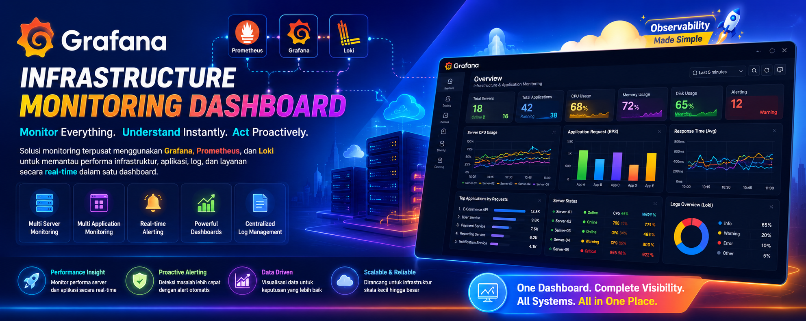
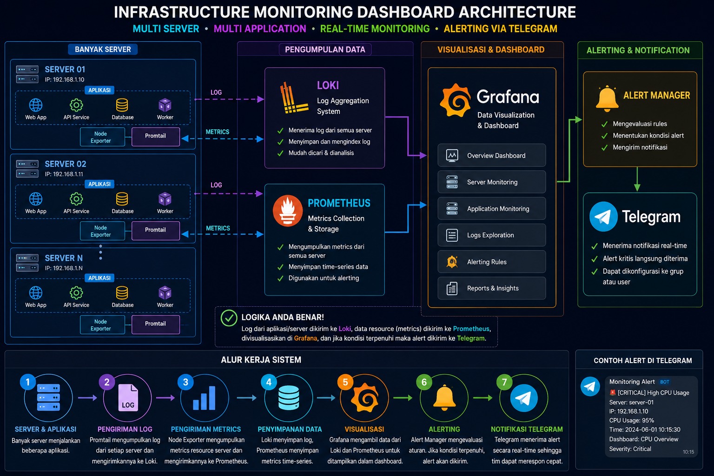
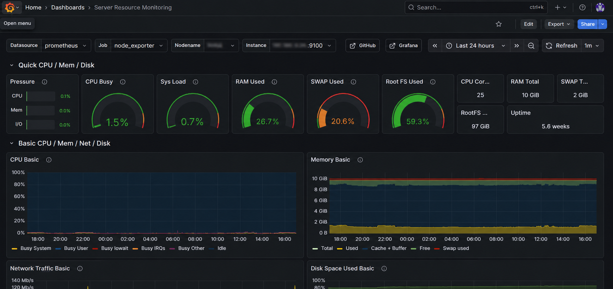
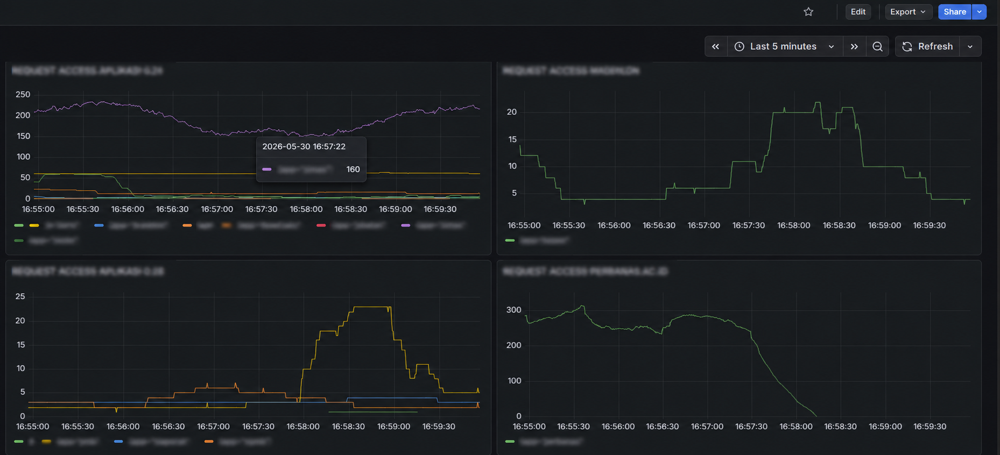
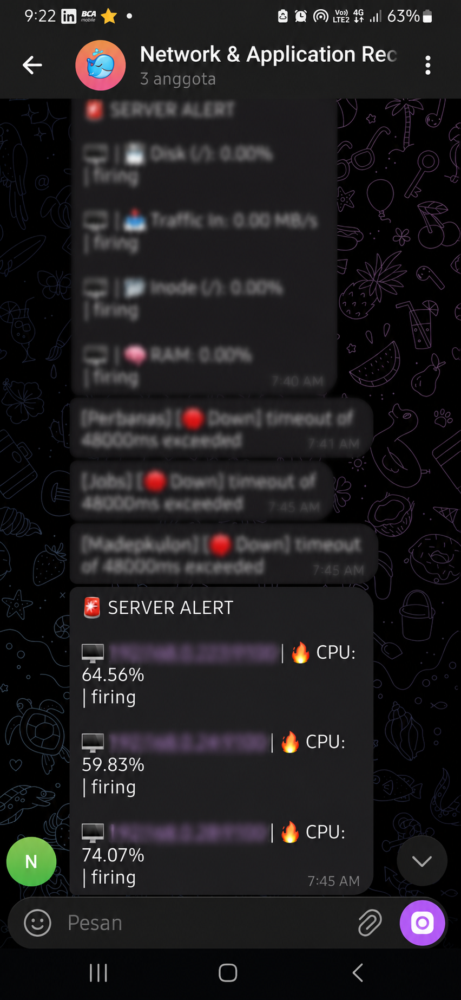

# GRAFANA, LOKI, PROMETHEUS SERVER APPLICATION MONITORING (SHOWCASE)

  

Aplikasi ini merupakan showcase / demo project yang digunakan untuk portofolio.
Beberapa data dan fitur mungkin tidak sepenuhnya lengkap atau disederhanakan untuk kebutuhan portofolio.

Infrastructure Monitoring Dashboard merupakan solusi observability berbasis Grafana, Prometheus, dan Loki untuk memantau server, aplikasi, dan log secara terpusat. Dilengkapi dengan Telegram Alerting, sistem membantu mendeteksi masalah lebih cepat melalui dashboard real-time dan notifikasi otomatis saat terjadi kondisi kritis.

---

## Tentang Project

Infrastructure Monitoring Dashboard dikembangkan untuk menyediakan visibilitas menyeluruh terhadap kondisi infrastruktur dan aplikasi yang berjalan pada berbagai server. Setiap server dapat menjalankan beberapa aplikasi sekaligus, sehingga diperlukan sistem monitoring yang mampu mengumpulkan, mengolah, dan menyajikan data performa secara terpusat.

Dashboard ini mengintegrasikan data metrik dari Prometheus dan data log dari Loki untuk menghasilkan informasi yang mudah dipahami melalui visualisasi Grafana. Administrator dapat mengidentifikasi aplikasi dengan beban akses tinggi, mendeteksi penggunaan resource server yang berlebihan, memantau kesehatan layanan, serta melakukan analisis log aplikasi dan sistem secara real-time.

Untuk meningkatkan kecepatan respons terhadap gangguan, sistem juga dilengkapi dengan mekanisme alerting yang terhubung ke Telegram. Ketika metrik atau log memenuhi kondisi tertentu yang telah ditentukan, notifikasi akan dikirim secara otomatis ke grup atau kanal Telegram tim operasional. Informasi yang dikirim mencakup detail server, aplikasi yang terdampak, tingkat keparahan masalah, serta waktu kejadian sehingga proses investigasi dapat dilakukan lebih cepat.

Implementasi monitoring dan alerting terpusat ini membantu meningkatkan keandalan layanan, mempercepat proses troubleshooting, mengurangi downtime, serta mendukung pengelolaan infrastruktur yang lebih efisien dan proaktif.

---

## Fitur Utama

Infrastructure Monitoring
* CPU Monitoring
* Memory Monitoring
* Disk Monitoring
* Network Monitoring

Application Monitoring
* Request Rate Monitoring
* Traffic Monitoring
* Application Availability Monitoring
* Multi Application Dashboard

Log Monitoring
* Centralized Log Aggregation
* Log Search
* Error Tracking
* Real-Time Log Analysis

Alerting System
* Telegram Notification
* CPU Usage Alert
* RAM Usage Alert
* Disk Usage Alert
* Application Down Alert

---

## Teknologi yang Digunakan

* Grafana
* Prometheus
* Loki
* Promtail
* Node Exporter
* Ubuntu Server
* Linux
* Telegram Bot API
* Docker

---

## Screenshot

### Arsitektur Sistem

  

### Dashboard Resource Monitoring Application

  

### Dashboard Access Monitoring Application

  

### Telegram Alert

  

---
